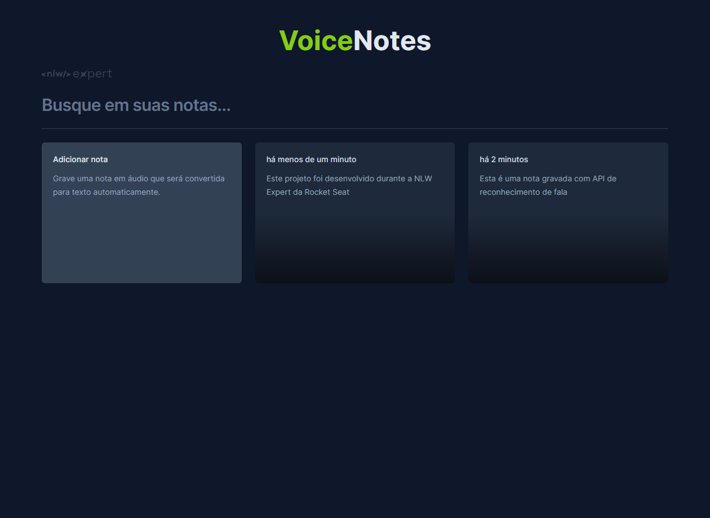
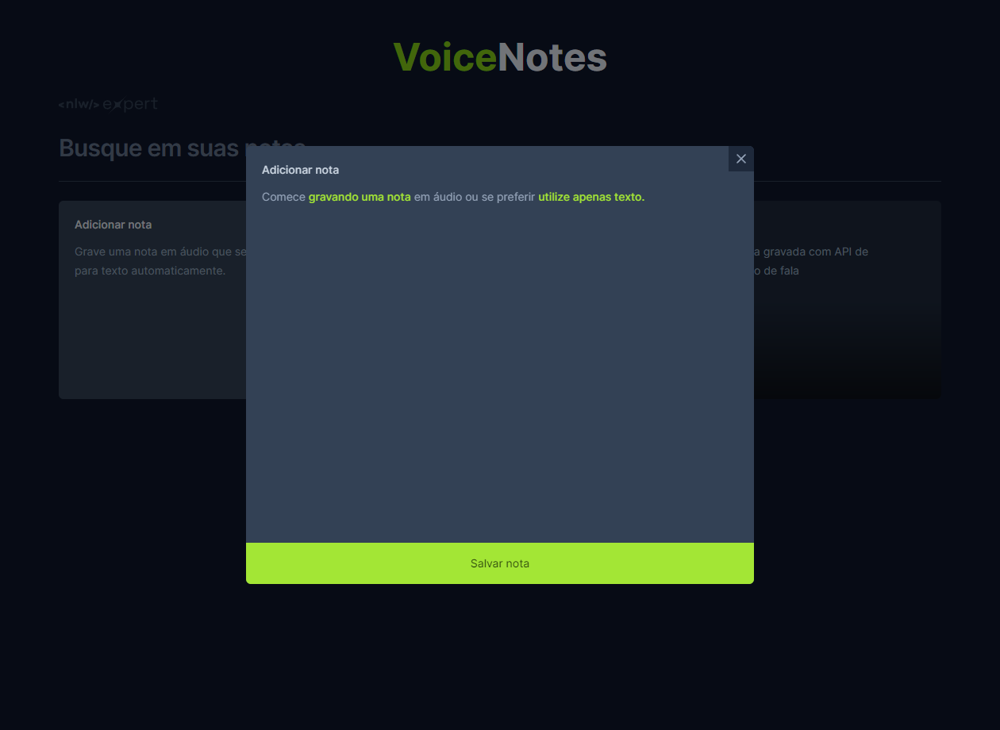
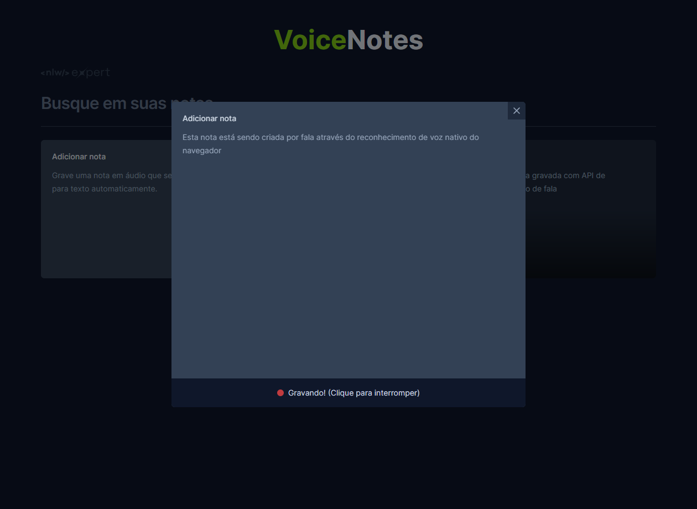

# Voice Notes

## Application to create notes using voice

> The project aimed to improve knowledge about the browser's native speech recognition API, using React+Vite, TypeScript and Tailwind to build it.

🔗 [Click here to access](https://matheusborgesdev.github.io/Voice-Notes/)

## 💻 Technologies

- React+Vite
- TypeScript
- Tailwind

## 📧 Contact

matheusb.dev@gmail.com
